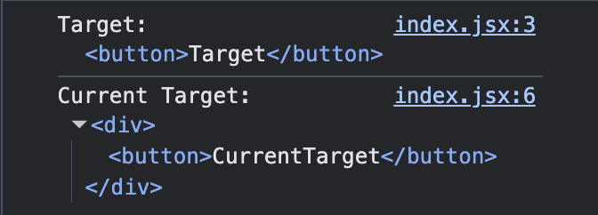

## Target 과 CurrentTarget의 차이

### Target

> 발생하는 이벤트가 어디서 발생했는지 가져올 수 있다.  
> 즉 **이벤트가 발생한 요소**

### CurrentTarget

> 발생하는 이벤트를 전달받은 요소를 가져올 수 있다.  
> 즉 **발생한 이벤트와 연결된 요소**

그림을 보면 설명한대로 정보를 가져오는 것을 확인 할 수 있다.
